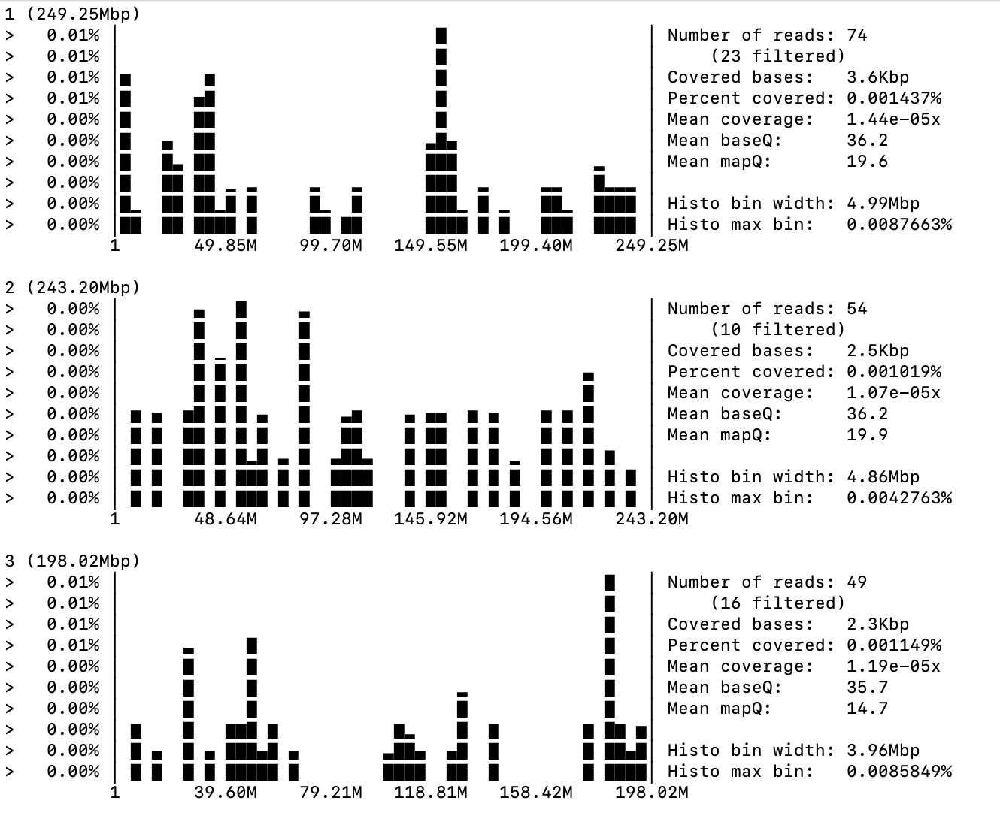
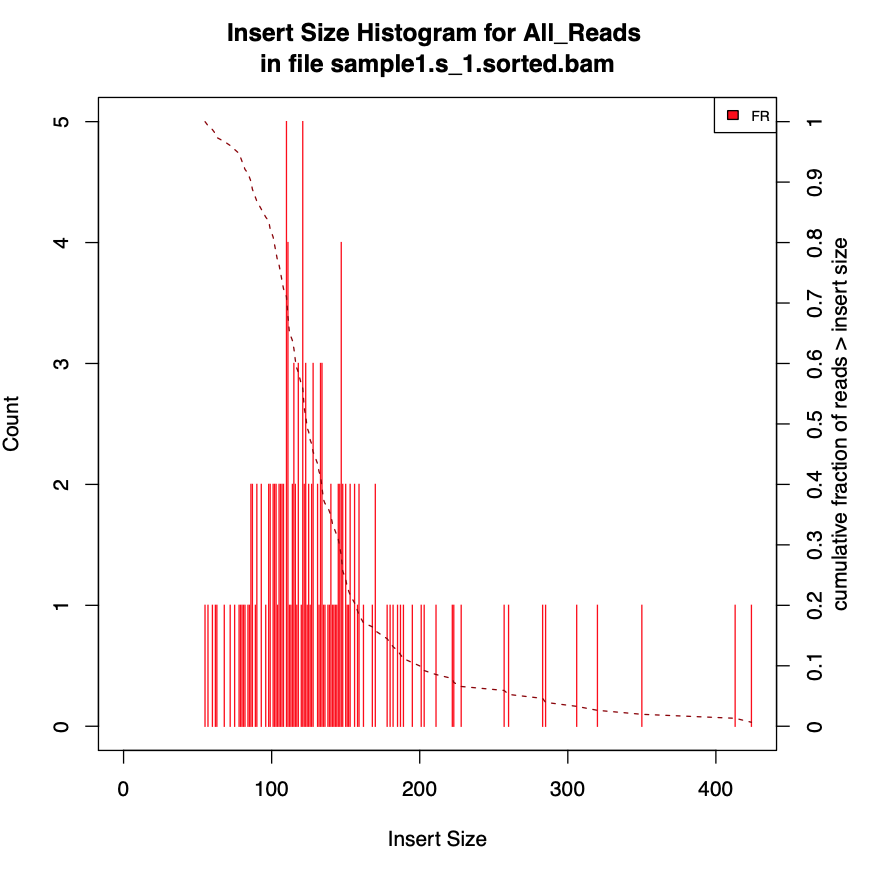

Magnifier 
============================================================

Magnifier is a snakemake  pipeline that help magnifies what's in your sample, check GC bias, coverage, etc. More ways of investigating your samples will be included as we go.
 
Update config files for different with you samples names and other parameters. 

## Mapping Percentages and Quality 

You will get a plot of percentages of primary and secondary alignments. In addition to percentage of unmapped reads and quality of mapped reads for each sample. 

   

## GCBias  

   Investigates GCbias in your samples. It out put several metrics (txt files) and wraps them up in a figure, as follows: 
    
   

## CoverageHistogram  

   Outputs a histogram of coverage of your sample, a sample output example is:
  
    

## InsertSize

   Outputs several metrics for insert size, and a wrapped up figure as follows: 

   

## check_contaminate 

   Outputs a nice plot as below to check contamination: 
  
   

### Run all investigation rules 

where n is the number of cores for example for 10 cores use:

    snakemake -j10 

### Use conda 

For less froodiness, use conda:

    snakemake -jn --use-conda 

For example, for 10 cores use: 

    snakemake -j10 --use-conda 

This will pull automatically the same versiosn of tools we used. Conda has to be installed in the system, in addition to snakemake. 

### Dry Run

For a dry run use: 
  
  
    snakemake -j1 -n 

and to print command in dry run use: 

  
    snakemake -j1 -n -p 

#### References 

1. https://www.bioinformatics.babraham.ac.uk/projects/fastq_screen
2. http://broadinstitute.github.io/picard/  
